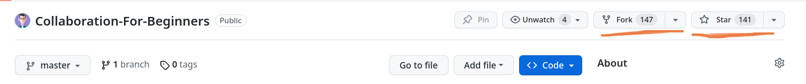
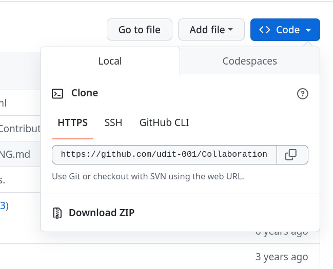

# Collaboration Guide for Beginners


[](https://www.firsttimersonly.com/)
[](https://hits.seeyoufarm.com)
[](https://www.buymeacoffee.com/idiomprog)


Learning to collaborate can be difficult for the first time contributors, and it may seem tedious to find open source projects to contribute to without adequate knowledge of programming. But fear not, this project is made especially to ease the process of contributing to an open source project for a newcomer.

>Check out other awesome contributors of this project [here.](https://udit-001.github.io/Collaboration-For-Beginners/Contributors)

## Contribution Guide

Here are the steps to contribute to this project:

1. Star this repository
2. Fork this repository.



1. Clone the fork you just created on your computer.



Type the following command on Git bash console:
```git
git clone https://github.com/udit-001/Collaboration-For-Beginners.git
```

Replace the above git repo link with that of the fork you just created.

1. Now before making changes to the files, let's take a different route than the usual tutorials you see on the internet, and let's try to do this in an efficient manner. 

For that, first go to your terminal under the repo you just cloned, and type the following:

```git
git checkout -b add-my-name
```

By running the above command, you just created a new branch called `add-my-name` and checked it out, what this does is that it creates a new branch with the commit history of the master branch or the branch that you were on previously.

5. Now open `Contributors.md` and enter the details in the following format.

```
#### Name: [YOUR NAME](GitHub Link)
- Place: City, Country
- Bio: Who are you?
- GitHub: [Your Name](GitHub Link)
```

6. Enter the following commands into your `terminal`:
```git
git add Contributors.md
git commit -m "Added myself to Contributors.md"
git push origin add-my-name
```

This will create a new commit with the changes you made in the `Contributors.md` file. Then we pushed these updates on the `add-my-name` branch of your fork.

7. Now create a pull request and add the title as `"Added myself to Contributors.md"`


1. Sit back and relax while your pull request is being reviewed and merged.

## Cleanup Process
After your pull request has been merged in the project, you can safely delete the branch called `add-my-name` you created above.

You can do this by using the GitHub UI itself, just go the pull request you created and you will see something like this:


Just click on delete branch, and you're done.

## Syncing a Fork
Now if you were to contribute to a project only once, the above instructions would work just fine. But if you were to contribute to a project on a regular basis, you would run across a very common issue, that is how to update your fork with the changes made in the original project. So let's begin with the process:

1. First you will need to add a remote for the original project to the local repository of your fork present on your system. To do this, enter the following into your terminal:

```
git remote add upstream https://github.com/udit-001/Collaboration-For-Beginners.git
```

This just added a remote by the name `upstream` to the original project.


2. If you've made any changes on your local repository, you will either need to commit them first or you can stash them. Then enter the following into your terminal:

```
git pull upstream master 
```

That's it, now your repository is up to date with the changes in the original project.

3. Let's update our fork on GitHub now, type the following into your terminal:

```
git push origin master
```

And now, your fork is also up-to-date.


## Reference Links

- Syncing a Fork : [https://help.github.com/articles/syncing-a-fork/](https://help.github.com/articles/syncing-a-fork/)
- Merging an upstream repository into your fork : [https://help.github.com/articles/merging-an-upstream-repository-into-your-fork/](https://help.github.com/articles/merging-an-upstream-repository-into-your-fork/)
- Configuring a Remote for a Fork : [https://help.github.com/articles/configuring-a-remote-for-a-fork/](https://help.github.com/articles/configuring-a-remote-for-a-fork/)
- Collaborating with Issues and Pull Requests : [https://help.github.com/categories/collaborating-with-issues-and-pull-requests/](https://help.github.com/categories/collaborating-with-issues-and-pull-requests/)

## Further Instructions to Proceed from here
- [Open Source Guide](https://opensource.guide/)
- [First Contributions](https://github.com/Roshanjossey/first-contributions)
- [Hacktoberfest](https://github.com/AliceWonderland/hacktoberfest)

## How To Choose a License
GitHub License Explained : [https://choosealicense.com](https://choosealicense.com)
